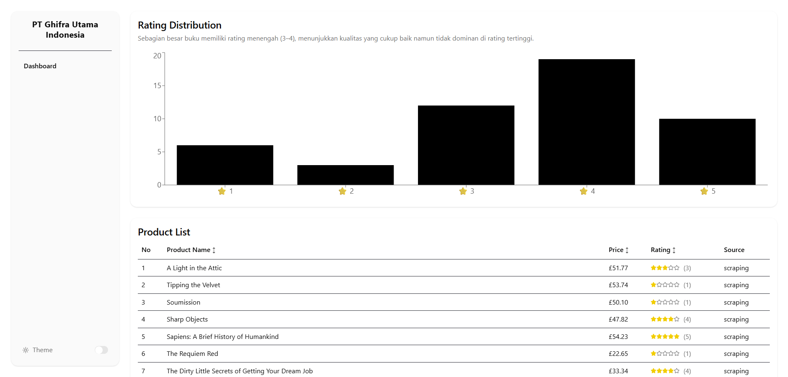
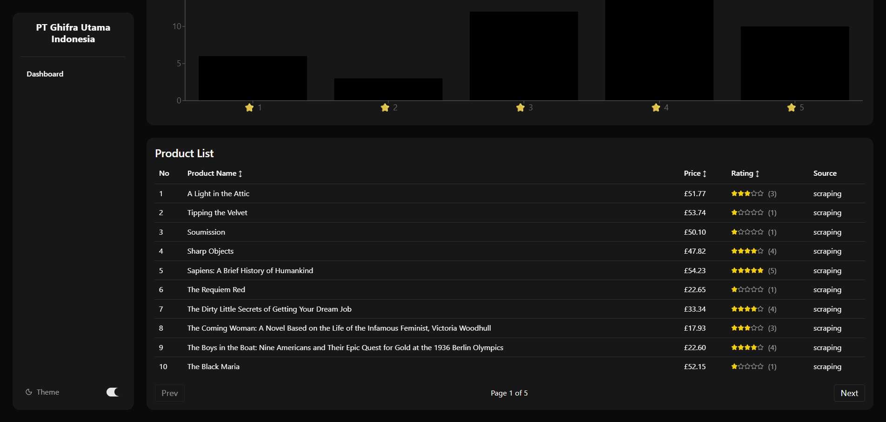

# 📊 Product Performance Dashboard (Frontend)

## 📌 Deskripsi Project

Project ini merupakan bagian frontend dari sistem Full Stack yang bertujuan untuk membantu brand memahami performa produk berdasarkan data hasil scraping dan API.

Dashboard ini menampilkan data dalam bentuk visual (chart) dan tabel agar mudah dianalisis.

---

## ✨ Fitur Utama

- 📊 Visualisasi distribusi rating produk
- 📋 Table produk dengan pagination & sorting
- 🌙 Dark mode toggle
- ⚠️ Error handling & loading state

---

## ⚙️ Teknologi yang Digunakan

- React JS (Vite)
- Tailwind CSS
- shadcn/ui
- Recharts
- Axios
- Lucide React

---

## 🔗 Integrasi API

Backend berjalan di:

http://localhost:3000

Frontend mengambil data dari endpoint berikut:

### Endpoint:

- `GET /products` → mengambil semua produk
- `GET /products?limit=10` → membatasi jumlah data
- `GET /products?rating=3` → filter berdasarkan rating
- `GET /products?name=book` → search berdasarkan nama
- `GET /products?source=api` → filter berdasarkan sumber data

### Contoh Request:

- http://localhost:3000/products
- http://localhost:3000/products?limit=10
- http://localhost:3000/products?rating=3

### Catatan:

- Backend berjalan di port `3000`
- Frontend (Vite) berjalan di port `5173`
- Frontend melakukan request langsung ke backend tanpa proxy

---

## 🚀 Cara Install & Menjalankan Project

### 1. Clone repository

```bash
git clone https://github.com/astroceilo/fe-test-skill-pt-ghifra
cd fe-test-skill-pt-ghifra
```

### 2. Install dependencies

```bash
npm install
```

### 3. Jalankan project

```bash
npm run dev
```

Akses di browser : http://localhost:5173

---

## 🧪 Testing

Pengujian dilakukan secara manual melalui browser.

### Metode Testing:

- Memastikan data dari API tampil di dashboard
- Menguji kondisi:
- Loading state
- Data kosong
- API error

### Hasil Testing:

- Data berhasil ditampilkan pada chart dan tabel
- Tidak terjadi error saat data kosong
- Pesan error muncul saat API gagal diakses

---

## 🔄 System Flow

Alur sistem:

Scraping / API
↓
Backend (Node.js / Express)
↓
Frontend (React Dashboard)
↓
User

---

## 📊 Insight Data

Contoh insight dari data:

- Produk dengan rating tinggi cenderung memiliki jumlah review lebih banyak
- Produk dengan harga rendah memiliki distribusi rating yang lebih stabil
- Terdapat produk dengan rating tinggi namun jumlah review rendah (indikasi produk baru)

---

## 🛠️ Maintenance

### Strategi:

- Struktur komponen modular (components, pages)
- Mudah menambahkan fitur baru
- Error handling sudah diterapkan

### Pengembangan ke depan:

- Menambahkan fitur filter lanjutan
- Menambahkan state management (Redux/Zustand)
- Optimasi performa

---

## 👨‍💻 Author

Doni Anggara

---

## 📸 Screenshot

### 📊 Dashboard (Chart)

Menampilkan distribusi rating produk dalam bentuk chart dan juga data produk dalam bentuk tabel dalam 1 halaman.



### 📋 Table Produk

Menampilkan data produk dengan pagination dan sorting.


